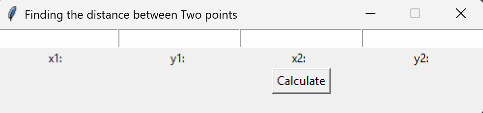

# Canvas
This is an application calculates between two points.

I wrote this application because the teacher assigned us the project on Wednesday. It was a hard project to do because I did not start working on the project until saturday. At first, I tried doing bar graphs, but we found out we had to an algebraic problem. Next I tried doing a quadratic equation, but it was too complex to solve the problem. Finally, I did a problem were I had to find the distance between the Two Points. I learned that even though you have little time to come up an application, you can still make a good application.